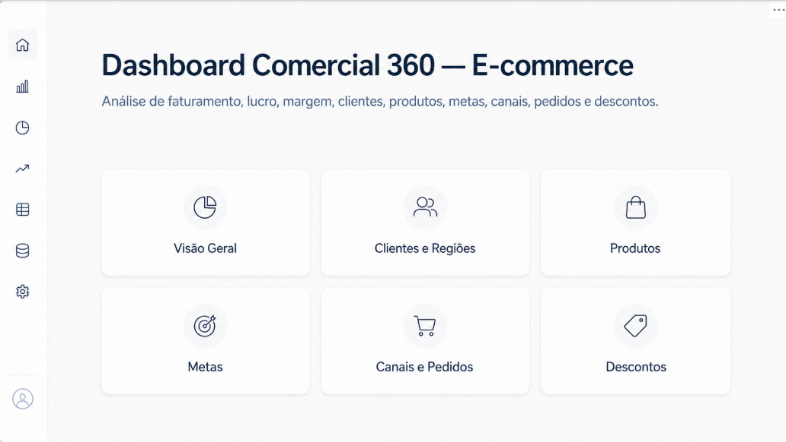
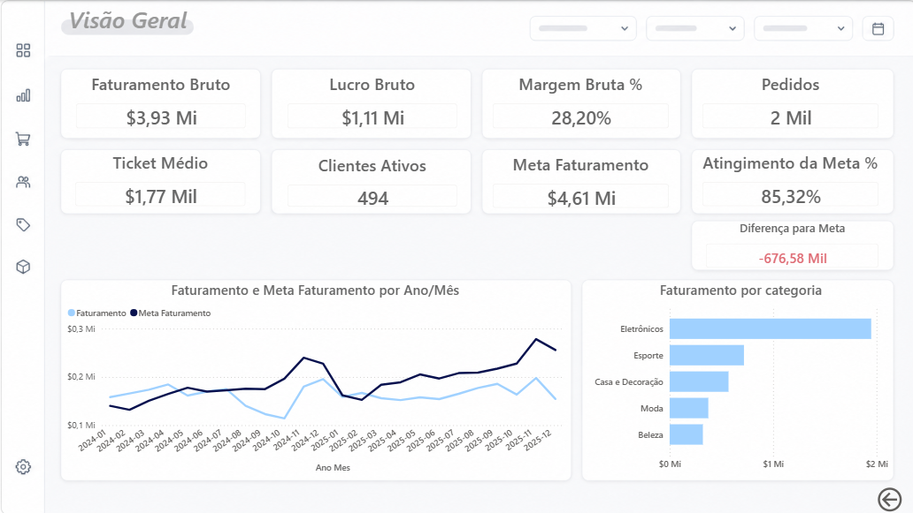
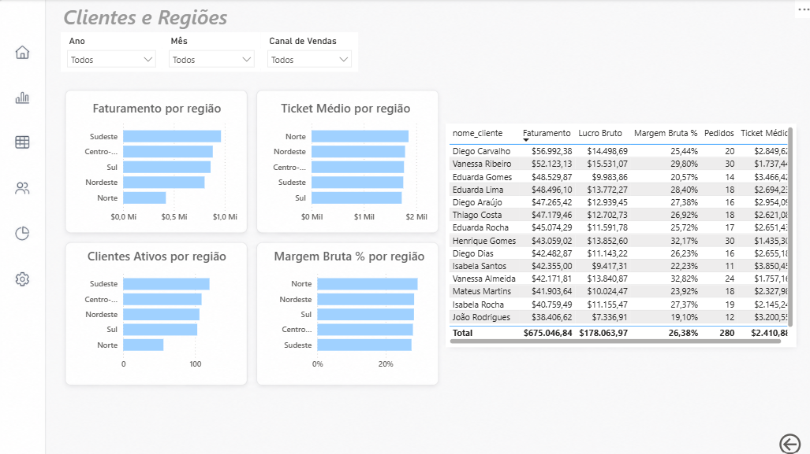
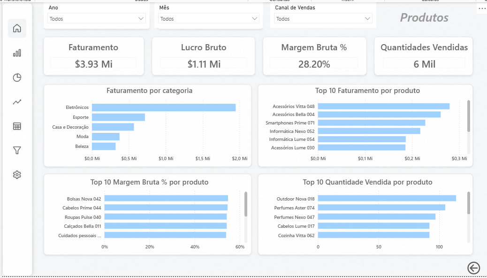
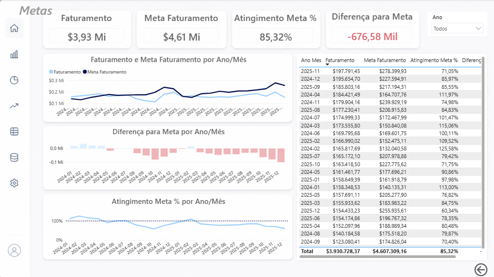
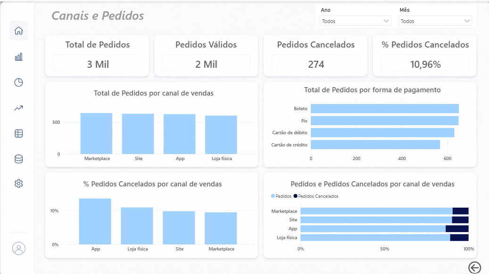
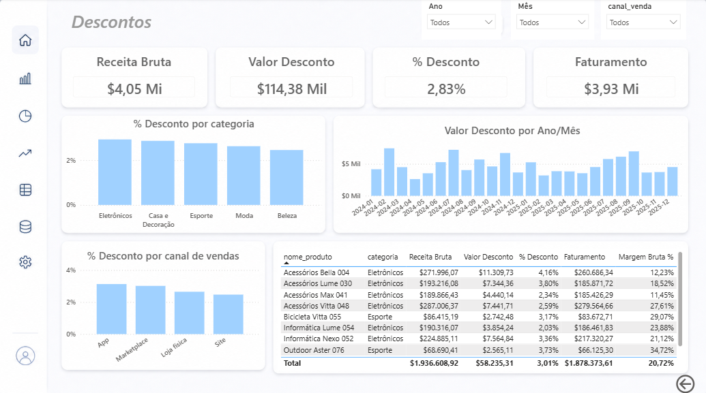

# Dashboard Comercial 360 — E-commerce

Projeto de portfólio desenvolvido com foco em análise comercial para um e-commerce fictício.

O objetivo é construir um dashboard no Power BI para acompanhar indicadores de faturamento, lucro, margem, ticket médio, pedidos, clientes, produtos, regiões, metas mensais, canais de venda, cancelamentos e descontos.

Além do dashboard, o projeto também inclui consultas SQL para demonstrar a lógica de análise dos dados em ambiente relacional.

---

## Ferramentas utilizadas

- Power BI Desktop
- Power Query
- DAX
- SQL
- SQLite
- CSV

---

## Bases utilizadas

O projeto utiliza dados fictícios organizados em cinco arquivos CSV:

- `clientes.csv`: dados cadastrais dos clientes.
- `produtos.csv`: catálogo de produtos com preço de venda, custo e categoria.
- `pedidos.csv`: cabeçalho dos pedidos, com cliente, data, status, canal de venda e forma de pagamento.
- `itens_pedido.csv`: produtos vendidos em cada pedido, com quantidade, preço e desconto.
- `metas.csv`: metas mensais de faturamento.

Os dados são sintéticos e foram criados apenas para fins de estudo e portfólio.

---

## Estrutura sugerida do projeto

```text
Dashboard_Comercial_360_Ecommerce
│
├── bases
│   ├── clientes.csv
│   ├── produtos.csv
│   ├── pedidos.csv
│   ├── itens_pedido.csv
│   └── metas.csv
│
├── database
│   └── comercial_360.sqlite
│
├── powerbi
│   └── Dashboard_Comercial_360_Ecommerce.pbix
│
├── sql
│   ├── 01_faturamento_por_mes.sql
│   ├── 02_top_produtos_faturamento.sql
│   ├── 03_faturamento_por_estado.sql
│   ├── 04_cancelamentos_por_canal.sql
│   ├── 05_ticket_medio_por_cliente.sql
│   ├── 06_realizado_vs_meta.sql
│   ├── 07_descontos_por_categoria.sql
│   └── 08_descontos_por_canal.sql
│
├── imagens
│
└── README.md
```

> Observação: no pacote original, a pasta dos CSVs pode aparecer como `dados`. Neste projeto, ela pode ser mantida como `dados` ou renomeada para `bases`, desde que os caminhos sejam ajustados no Power BI.

---

## Como usar o projeto

1. Abra o Power BI Desktop.
2. Importe os arquivos CSV da pasta `bases` ou `dados`.
3. Trate os dados no Power Query.
4. Monte o modelo de dados.
5. Crie as medidas DAX.
6. Desenvolva as páginas do dashboard.
7. Para treinar SQL, abra o banco `comercial_360.sqlite` em uma ferramenta como DB Browser for SQLite, DBeaver ou extensão SQLite no VS Code.
8. Rode os scripts da pasta `sql`.

---

## Modelagem utilizada

O projeto foi modelado com uma estrutura próxima ao modelo estrela.

### Tabela fato

- `fato_vendas`

Criada a partir da tabela `itens_pedido`, enriquecida com dados de `pedidos` e `produtos`.

Ela concentra os principais valores transacionais, como:

- quantidade
- preço de venda
- desconto
- receita bruta
- receita líquida
- custo total
- lucro bruto
- status do pedido
- canal de venda
- forma de pagamento

### Tabelas dimensão

- `clientes`
- `produtos`
- `Calendario`
- `metas`

A tabela `Calendario` foi criada para permitir análises por mês, ano, trimestre e comparação com metas mensais.

---

## Principais transformações no Power Query

Durante a preparação dos dados, foram realizadas etapas como:

- ajuste dos tipos de dados;
- remoção de duplicatas em clientes e produtos;
- conferência dos status dos pedidos;
- tratamento de descontos nulos;
- mesclagem de `itens_pedido` com `pedidos`;
- mesclagem de `itens_pedido` com `produtos`;
- criação da tabela `fato_vendas`;
- criação de colunas calculadas de receita, desconto, custo e lucro;
- criação da coluna de controle `pedido_valido`.

---

## Principais indicadores

O dashboard acompanha os seguintes indicadores:

- Faturamento
- Receita bruta
- Valor de desconto
- % desconto
- Custo total
- Lucro bruto
- Margem bruta %
- Pedidos
- Total de pedidos
- Pedidos cancelados
- % pedidos cancelados
- Ticket médio
- Clientes ativos
- Quantidade vendida
- Produtos vendidos
- Meta de faturamento
- Atingimento da meta %
- Diferença para meta

---

## Principais medidas DAX

Algumas das principais medidas criadas no projeto:

```DAX
Faturamento =
CALCULATE(
    SUM(fato_vendas[receita_liquida]),
    fato_vendas[pedido_valido] = TRUE()
)
```

```DAX
Custo Total =
CALCULATE(
    SUM(fato_vendas[custo_total]),
    fato_vendas[pedido_valido] = TRUE()
)
```

```DAX
Lucro Bruto =
[Faturamento] - [Custo Total]
```

```DAX
Margem Bruta % =
DIVIDE(
    [Lucro Bruto],
    [Faturamento],
    0
)
```

```DAX
Pedidos =
CALCULATE(
    DISTINCTCOUNT(fato_vendas[id_pedido]),
    fato_vendas[pedido_valido] = TRUE()
)
```

```DAX
Ticket Médio =
DIVIDE(
    [Faturamento],
    [Pedidos],
    0
)
```

```DAX
Clientes Ativos =
CALCULATE(
    DISTINCTCOUNT(fato_vendas[id_cliente]),
    fato_vendas[pedido_valido] = TRUE()
)
```

```DAX
Atingimento Meta % =
DIVIDE(
    [Faturamento],
    [Meta Faturamento],
    0
)
```

---

## Páginas do dashboard

O relatório foi organizado em páginas temáticas:

### Menu

Página inicial com botões de navegação para as demais áreas do dashboard.

### Visão Geral

Resumo executivo com os principais KPIs comerciais, evolução mensal do faturamento e comparação com metas.

### Clientes e Regiões

Análise de faturamento, clientes ativos, ticket médio, margem e ranking de clientes por estado ou região.

### Produtos

Análise de categorias e produtos, incluindo faturamento, margem, quantidade vendida e ranking dos principais produtos.

### Metas

Acompanhamento mensal de realizado x meta, diferença para meta e percentual de atingimento.

### Canais e Pedidos

Análise de origem dos pedidos, canais de venda, formas de pagamento, pedidos válidos, pedidos cancelados e taxa de cancelamento.

### Descontos

Análise de receita bruta, valor de desconto, percentual de desconto, descontos por mês, categoria, canal e produto.

---

## Consultas SQL

Além do desenvolvimento no Power BI, o projeto possui consultas SQL para demonstrar a lógica de análise dos dados em banco relacional.

As consultas estão organizadas na pasta `sql`:

- `01_faturamento_por_mes.sql`  
  Consulta de faturamento mensal, receita bruta e descontos.

- `02_top_produtos_faturamento.sql`  
  Ranking dos produtos com maior faturamento.

- `03_faturamento_por_estado.sql`  
  Análise de faturamento, lucro, margem, pedidos e clientes ativos por estado.

- `04_cancelamentos_por_canal.sql`  
  Análise de pedidos válidos, cancelados e percentual de cancelamento por canal de venda.

- `05_ticket_medio_por_cliente.sql`  
  Cálculo de ticket médio por cliente.

- `06_realizado_vs_meta.sql`  
  Comparação mensal entre faturamento realizado e meta de faturamento.

- `07_descontos_por_categoria.sql`  
  Análise de descontos por categoria de produto.

- `08_descontos_por_canal.sql`  
  Análise de descontos por canal de venda.

Essas consultas reforçam conceitos como:

- `JOIN`
- `GROUP BY`
- `SUM`
- `COUNT DISTINCT`
- `CASE WHEN`
- cálculo de percentuais
- tratamento de divisão por zero com `NULLIF`
- comparação entre realizado e meta

---

## Validações realizadas

Foram criadas medidas de conferência para validar os principais cálculos do dashboard.

### Conferência de Receita

```DAX
Conferência Receita =
ROUND(
    [Receita Bruta] - [Valor Desconto] - [Faturamento],
    2
)
```

Essa medida valida se:

```text
Receita Bruta - Valor Desconto = Faturamento
```

### Conferência de Lucro

```DAX
Conferência Lucro =
ROUND(
    [Faturamento] - [Custo Total] - [Lucro Bruto],
    2
)
```

Essa medida valida se:

```text
Faturamento - Custo Total = Lucro Bruto
```

As conferências ajudam a garantir a consistência dos cálculos antes da finalização do dashboard.

---

## Aprendizados do projeto

Este projeto teve como objetivo praticar o fluxo completo de construção de uma solução analítica:

- entendimento do problema de negócio;
- importação e tratamento de dados;
- criação de uma tabela fato;
- organização de tabelas dimensão;
- criação de calendário;
- modelagem de relacionamentos;
- criação de medidas DAX;
- construção de páginas analíticas no Power BI;
- análise de metas, produtos, clientes, canais e descontos;
- criação de consultas SQL equivalentes às análises do dashboard;
- validação dos cálculos principais;
- organização do projeto para portfólio.

---

## Observação final

Este projeto utiliza dados fictícios e foi desenvolvido exclusivamente para fins de aprendizado e demonstração de habilidades em análise de dados.

O objetivo é simular um cenário comercial real de e-commerce e demonstrar competências em Power BI, Power Query, DAX, SQL, modelagem e visualização de dados.

Prévia do Dashboard
Menu


Visão Geral



Clientes e Regiões



Produtos



Metas



Canais e Pedidos



Descontos

